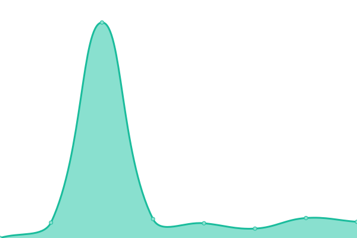

# [📈 Live Status](https://trinetra110.github.io/test-upptime): <!--live status--> **🟩 All systems operational**

This repository contains the open-source uptime monitor and status page for [Ayan Mondal](https://trinetra110.github.io/test-upptime), powered by [Upptime](https://github.com/upptime/upptime).

With [Upptime](https://upptime.js.org), you can get your own unlimited and free uptime monitor and status page, powered entirely by a GitHub repository. We use [Issues](https://github.com/trinetra110/test-upptime/issues) as incident reports, [Actions](https://github.com/trinetra110/test-upptime/actions) as uptime monitors, and [Pages](https://trinetra110.github.io/test-upptime) for the status page.

<!--start: status pages-->
<!-- This summary is generated by Upptime (https://github.com/upptime/upptime) -->
<!-- Do not edit this manually, your changes will be overwritten -->
<!-- prettier-ignore -->
| URL | Status | History | Response Time | Uptime |
| --- | ------ | ------- | ------------- | ------ |
|  [IHR](https://www.ihr.live) | 🟩 Up | [ihr.yml](https://github.com/trinetra110/test-upptime/commits/HEAD/history/ihr.yml) | 

 519ms
     
 | 

<a href="https://trinetra110.github.io/test-upptime/history/ihr">100.00%</a>
    

|  [IHR Global Report](https://www.ihr.live/en/global-report) | 🟩 Up | [ihr-global-report.yml](https://github.com/trinetra110/test-upptime/commits/HEAD/history/ihr-global-report.yml) | 

 205ms
     
 | 

<a href="https://trinetra110.github.io/test-upptime/history/ihr-global-report">100.00%</a>
    

|  [IHR API website](https://www.ihr.live/en/api) | 🟩 Up | [ihr-api-website.yml](https://github.com/trinetra110/test-upptime/commits/HEAD/history/ihr-api-website.yml) | 

 205ms
     
 | 

<a href="https://trinetra110.github.io/test-upptime/history/ihr-api-website">100.00%</a>
    

|  [IHR API /countries](www.ihr.live/ihr/api/countries) | 🟩 Up | [ihr-api-countries.yml](https://github.com/trinetra110/test-upptime/commits/HEAD/history/ihr-api-countries.yml) | 

 663ms
     
 | 

<a href="https://trinetra110.github.io/test-upptime/history/ihr-api-countries">100.00%</a>
    

|  [IHR Archive](https://archive.ihr.live) | 🟩 Up | [ihr-archive.yml](https://github.com/trinetra110/test-upptime/commits/HEAD/history/ihr-archive.yml) | 

 495ms
     
 | 

<a href="https://trinetra110.github.io/test-upptime/history/ihr-archive">100.00%</a>
    

|  [IYP](https://iyp.iijlab.net) | 🟩 Up | [iyp.yml](https://github.com/trinetra110/test-upptime/commits/HEAD/history/iyp.yml) | 

 358ms
     
 | 

<a href="https://trinetra110.github.io/test-upptime/history/iyp">100.00%</a>
    

|  [IYP Database](iyp-bolt.iijlab.net) | 🟩 Up | [iyp-database.yml](https://github.com/trinetra110/test-upptime/commits/HEAD/history/iyp-database.yml) | 

 164ms
     
 | 

<a href="https://trinetra110.github.io/test-upptime/history/iyp-database">100.00%</a>
    

|  [IHR archive global hegemony IPv4 files](https://archive.ihr.live/ihr/hegemony/ipv4/global/2020/01/01/) | 🟩 Up | [ihr-archive-global-hegemony-i-pv4-files.yml](https://github.com/trinetra110/test-upptime/commits/HEAD/history/ihr-archive-global-hegemony-i-pv4-files.yml) | 

 199ms
     
 | 

<a href="https://trinetra110.github.io/test-upptime/history/ihr-archive-global-hegemony-i-pv4-files">100.00%</a>
    

|  [IHR archive IYP files](https://archive.ihr.live/ihr/iyp/2025/02/08/) | 🟩 Up | [ihr-archive-iyp-files.yml](https://github.com/trinetra110/test-upptime/commits/HEAD/history/ihr-archive-iyp-files.yml) | 

 199ms
     
 | 

<a href="https://trinetra110.github.io/test-upptime/history/ihr-archive-iyp-files">100.00%</a>
    

|  [IHR countries API](www.ihr.live/ihr/api/countries) | 🟩 Up | [ihr-countries-api.yml](https://github.com/trinetra110/test-upptime/commits/HEAD/history/ihr-countries-api.yml) | 

 32ms
     
 | 

<a href="https://trinetra110.github.io/test-upptime/history/ihr-countries-api">100.00%</a>
    

<!--end: status pages-->

[**Visit our status website →**](https://trinetra110.github.io/test-upptime)

## 📄 License

- Powered by: [Upptime](https://github.com/upptime/upptime)
- Code: [MIT](./LICENSE) © [Anand Chowdhary](https://anandchowdhary.com), supported by [Pabio](https://pabio.com)
- Data in the `./history` directory: [Open Database License](https://opendatacommons.org/licenses/odbl/1-0/)
